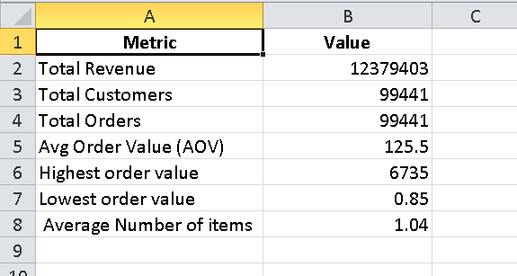
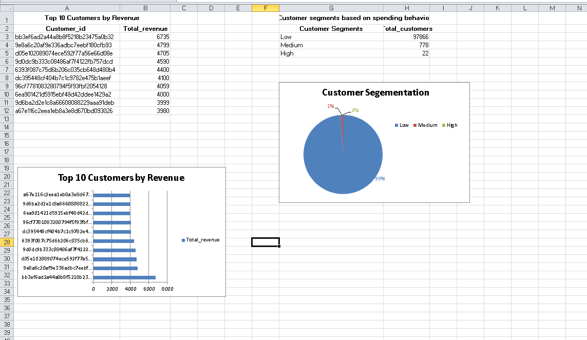
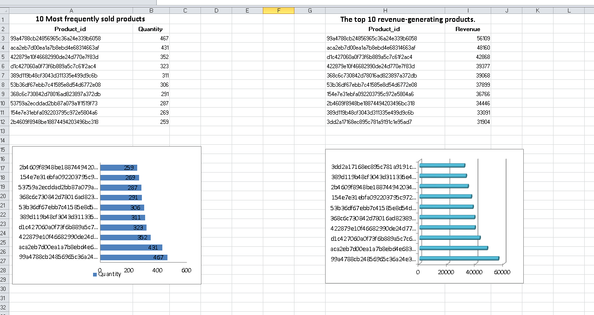
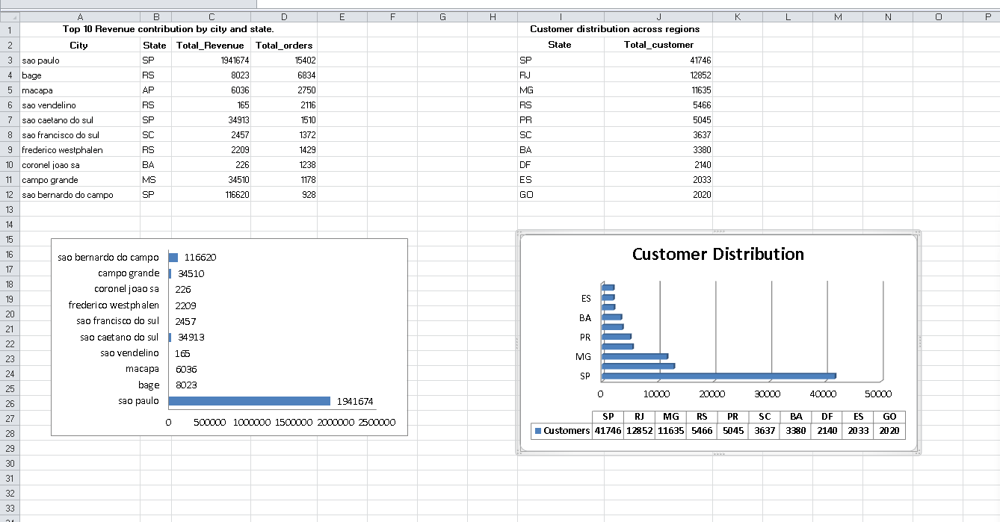
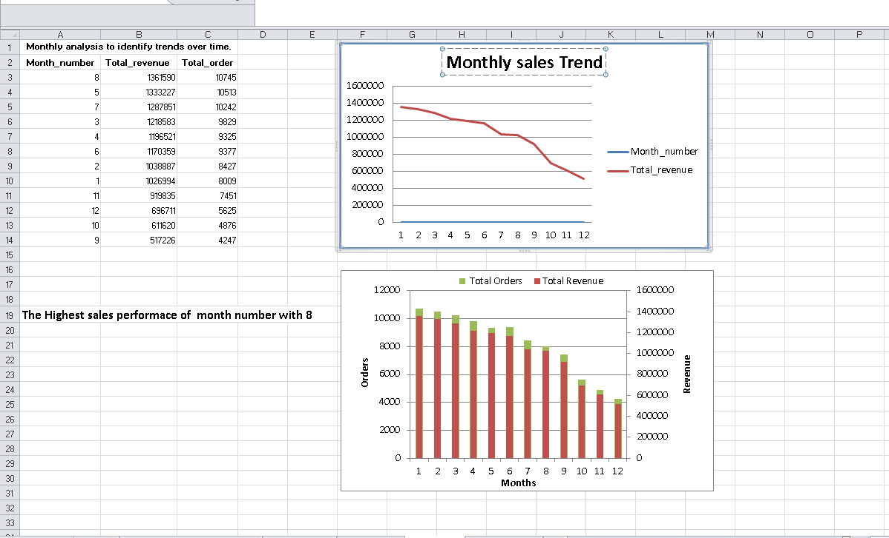

# E-commerce Sales Analysis

##  Overview
This project analyzes an e-commerce dataset using SQL and Excel to generate actionable business insights.

## 🛠 Tools Used
- SQL (MySQL)
- Excel (Pivot Tables, Charts, Dashboard)

##  Key Metrics
- Total Revenue: 12,379,403
- Total Customers: 99,441
- Total Orders: 99,441
- Average Order Value (AOV): 125.5

##  Analysis Performed
- Top 10 customers by revenue
- Customer segmentation (High / Medium / Low)
- Most sold products
- Top revenue-generating products
- Revenue by city and state
- Monthly sales trends
- Payment method analysis

##  Project Structure
- data/
- sql/
- dashboard/
- images/

##  Dashboard Screenshots

### KPI Dashboard

### Customer Analysis

### Product Analysis

### Location Analysis

### Time Analysis

##  Conclusion
This project demonstrates end-to-end data analysis using SQL and Excel, including data cleaning, KPI tracking, and business insights generation.
